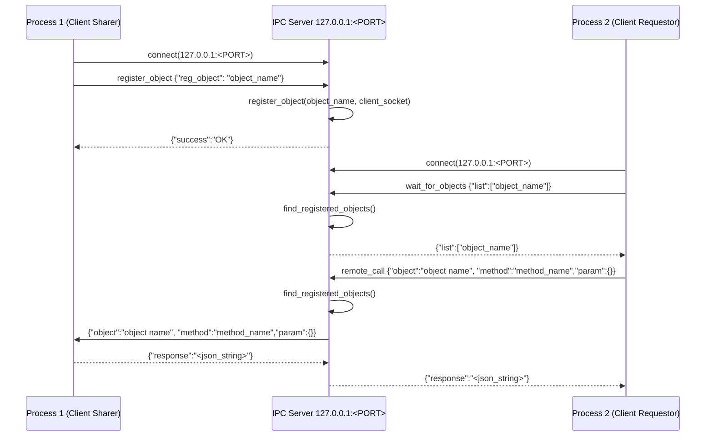

# ipc-server
An inter-process communication system that manages messages across processes via TCP stream.
It uses JSON format strings as a protocol when exchanging messages across processes.

This is also a library for the client-side processes for Rust.
The user application can share the object across the TCP stream.

## Overview of the IPC Server, registering objects and making remote calls
